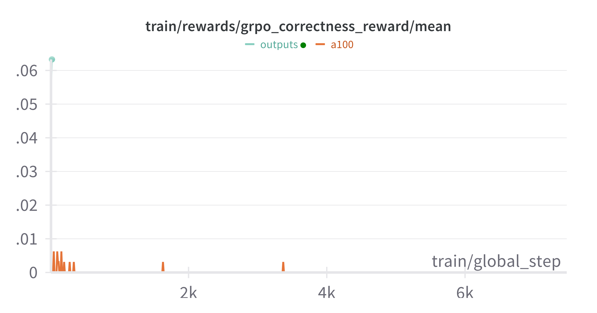
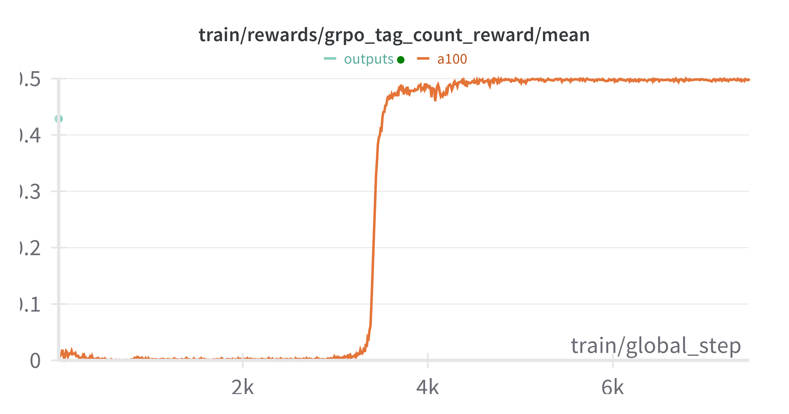
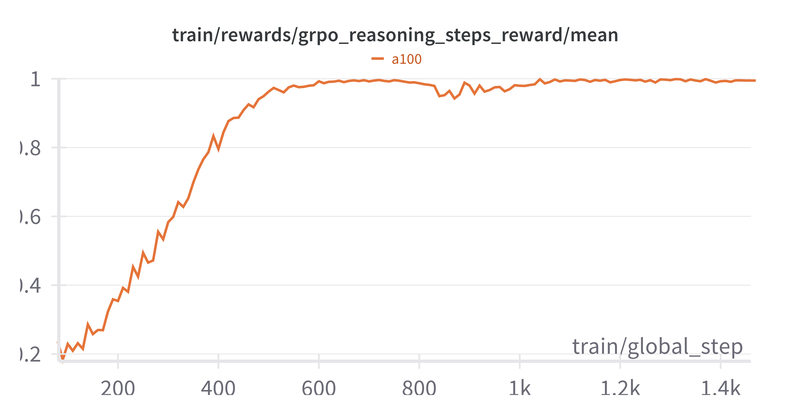

# Qwen Reasoning

## Setup

```
uv venv --python=3.12.3
uv pip install -r requirements.txt
uv pip install torch -f https://data.pyg.org/whl/torch-2.6.0+cpu.html
uv pip install torch-geometric -f https://data.pyg.org/whl/torch-2.6.0+cpu.html
uv pip install torch-scatter -f https://data.pyg.org/whl/torch-2.6.0+cpu.html
uv pip install torch-sparse -f https://data.pyg.org/whl/torch-2.6.0+cpu.html
```

<!-- Работало на Intel Ice Lake with NVIDIA® Tesla® T4	и Intel Ice Lake with T4i -->

## Eval
```
python3 cmp/gen.py --mode base
python3 cmp/calc.py --mode base
python3 cmp/gen.py --mode tuned
python3 cmp/calc.py --mode tuned
```

## Attempt #1

Вначале я использовал функции примера в документации unsloth. И там была следующая проблема: не было reward функции "хвалящей" за длину reasoning. Поэтому ответы модели свелись к 
```
<reasoning>
#2
</resoning>
<answer>
#1
<answer>
```
И `#1` и `#2` были близки к случайным числам. Точно ответов модели сильно упала: с 300 до 80, но при этом, модель идеально научилась соблюдать требуемый формат.

## Attempt #2

Потом, функции для наград были вдохновлены [Open R1](https://github.com/huggingface/open-r1).
И снова фиаско: функции оказались слишком "сложными" для такой маленькой модели.

В результате, мы даже не получили соблюдение формата: в итоге среднее количество используемых тегов было 2 из 4х.
С правильностью ответов тоже всё было плохо.
<p align="center">
  
  
</p>

Косвенные метрики забрали вес у более значимых: `correctness` и `format`. Например, в течении работы, улучшалось значение метрики `grpo_reasoning_steps_reward`. То есть по косвенным метрикам, модель училась "лучше рассуждать", но это было во вред правильности ответов.
<p align="center">
  
</p>


## Summary
| | Before (0.5b)  | Open R1 rewards | Qwen Colab rewards | 
| ------------- | ------------- | ------------- | ------------- |
| Correct Format | 4/1319  | 2/1319  | 1319/1319 |
| Correct Answer | 301/1319  | 31/1319  | 81/1319 |

Тут можно сделать промежуточные выводы: нам не нужны сложные `reward`-функции. Лучше возьмём модель побольше (`3b`), и добавим к `reward`-ам еще "похвалу" за длину, взятую из `Open R1`, а там она взята из [Kimi 1.5](https://huggingface.co/papers/2501.12599). 

## Length reward (working HARD)
Основное изменение третей попытки от предыдущих: функциях `grpo_length_efficiency_reward`

<pre>
len_reward(i) = {
  λ                               if r(x, y<sub>i</sub>, y<sub>*</sub>) = 1
  min(0, λ)                       if r(x, y<sub>i</sub>, y<sub>*</sub>) = 0
}
where λ = 0.5 - (len(i) − min_len) / (max_len − min_len)
</pre>

На интуитивном уровне, она работает следующим образом: среди решений с правильным ответом она чуть больше награждает короткие решения, а среди неправильных решений наказывает длинные неправильные решения. Это как раз то, чего мы хотели в `HARD` части: чтобы генерация была покороче, но при этом всё еще правильная. 

## Attempt #3 

Запуск:
```
python3 main.py
```

Все `reward`-функции вынесены в файл `rewards.py`. 
1. `grpo_correctness_reward`. Поощряем правильные ответы. Вес у данной награды 2.
2. Поошрение формата:
2.1. `grpo_formatting_reward`. Полное соблюдение формата. Весь 0.5
2.2. `grpo_tag_count_reward`. Промежуточная функция для поощрения соблюдения формата: за каждый использованный тег даём по `0.5/4 = 0.125`
3. `grpo_length_efficiency_reward`. Вышеописанная функция. Поощряем которткие, но правильные решения
4. `grpo_reasoning_steps_reward`. Поощряем хорошую структуру рассуждений. Функция взята из `Open R1`.

В результате, в `grpo_saved_lora` будет находиться обученная модель. 
